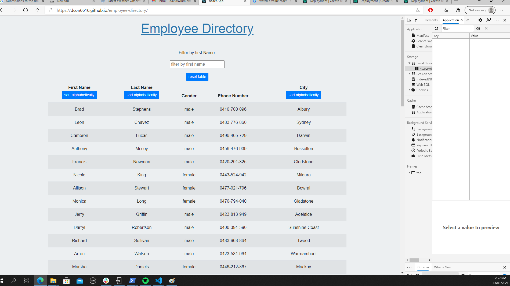
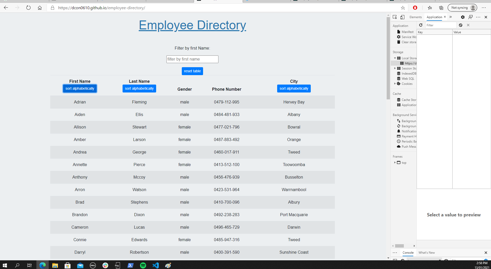
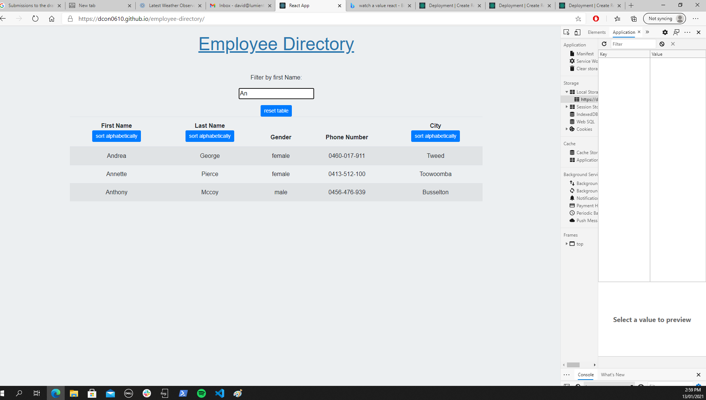

This assignment is an employee directory with React.

It selects a table of random users from "https://randomuser.me/api/?results=50&nat=au", where it returns 50 people from Australian cities.  When the user loads the page, this table renders.

The user should be able to: 

  * The table is able to be sorted alphabetically by first name, last name, or city. The reset the table button resets the table to the original order of the table. 

  * The table is able to be filtered by first name. When the first name is typed in the box, only the matching names will appear. When the box is cleared by back spacing, all the users reappear and the table resets. 

#Structure of the App
  1. App.js renders the Navbar and the Table components. The Navbar is just a simple heading.
  2. The Table component is where much of the code is. 
      1. The state is set with two main important parts: Employees, and original employees as initially empty. 
      2. When the component mounts in the "Component did mount" function, the API gets the 50 random users and sets the state in two arrays: originalEmployees, and employees. 
      3. The sort has a switch statement to check which column is being sorted on, and uses an array.sort function to perform the operation. The resultant array is pushed to the employees in the state. 
      4. when the reset button is clicked, employees is reset using the originalEmployees in the state. 
      5. The filter button filters the employee array in the state using a string.startsWith function and returning that into the array if its true. 
      6. Whatever is in the state.employees array is passed through to a Table Data component to render on this page. 
      
      Page with original table loaded
      

Page with sorted data (sorted by first name)

Page with filtered data (filtered by starting with the two letters "An")

      
